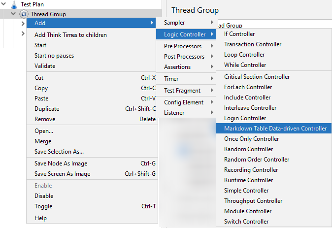
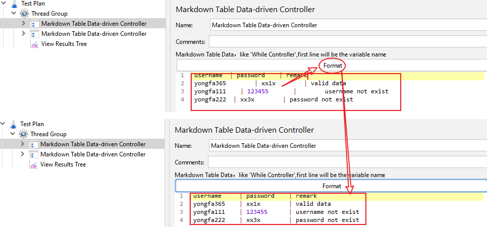
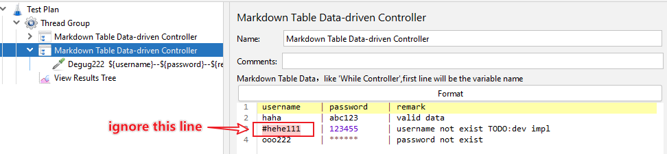
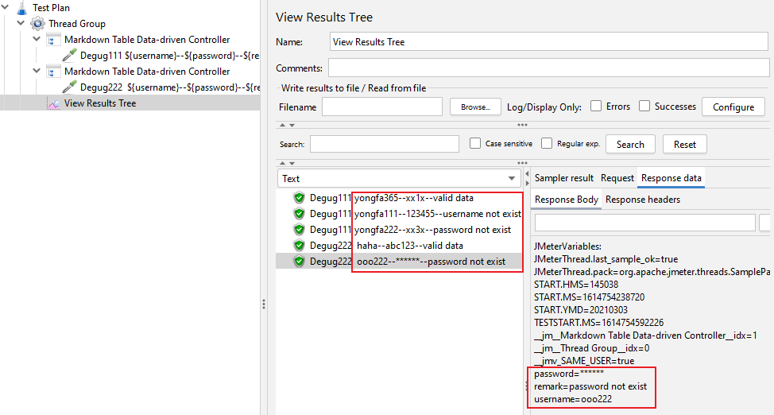
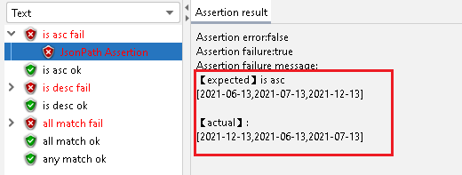
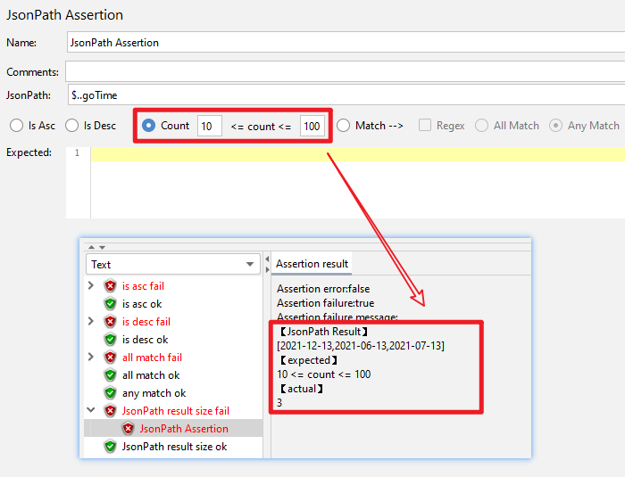
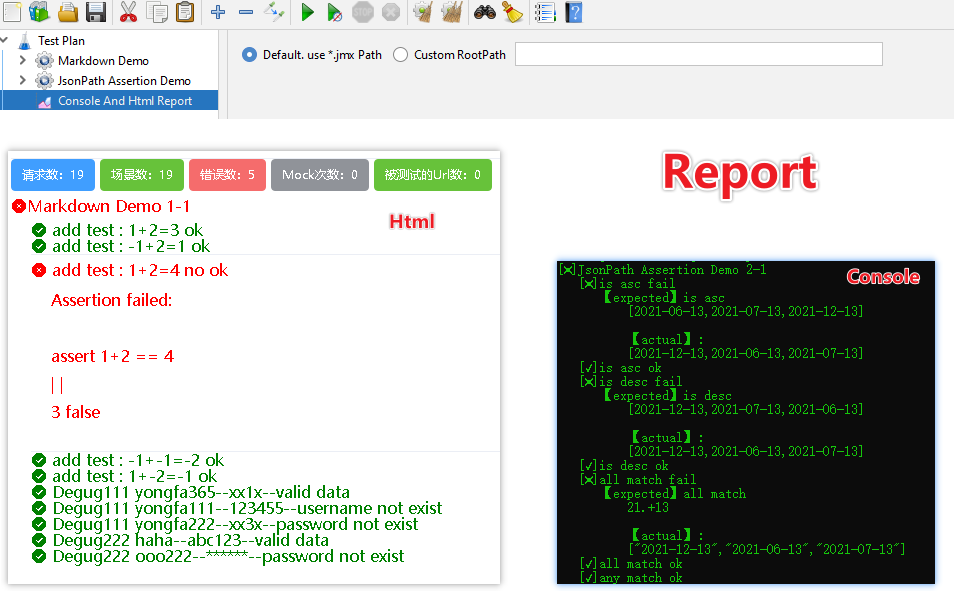

# Feature 1: Markdown Table Data-driven Controller

## Data-driven Test Comparison

|While Controller|Markdown Table Data-driven Controller|
|--|--|
|It is tedious to use: [while+csv+if is needed to complete data iteration, and the while condition](https://www.blazemeter.com/blog/using-while-controller-jmeter)|Case data Only|
|CSV is not friendly: 1. It is not convenient to view, so you need to switch back and forth between GUI and CSV. 2. Need to consider files encoding, such as utf-8 commonly, but it leads to Excel open garbled | Don't care about file coding, in unity on the GUI, use case visualization|
|Multiple while coexisting is not easy to handle: you need to consider that the condition used in the previous while cannot be used in the next one, otherwise the previous one will mark its end and the next one will simply exit.| Mutual noninterference
| Nonsupport 'ignore line' | Support

|While Controller|Markdown Table Data-driven Controller|
|--|--|
|使用繁琐：[需要while+csv+if三个配合才能完成数据遍历，还需要写while的条件](https://www.blazemeter.com/blog/using-while-controller-jmeter)|仅仅需要用例数据|
|csv不友好：1.查看不方便，需要在GUI与csv之间来回切换。2.需要考虑文件编码，如一般都统一utf-8，但这样会导致Excel打开乱码|不关心文件编码，在统一的GUI上可见，用例可视化|
|多个while并存不好处理：需要考虑上一个while使用的条件不能在下一个里使用，否则上一个标识其已经结束，导致下一个while直接退出。|互不干扰|
|无法忽略掉部分用例|支持忽略，数据行前面加#就行|


## Instruction

### Step I: Add this controller
right click 'Thread Group' --> Add --> Logic Controller --> Markdown Table Data-driven Controller


### Step II: Use it
Provide data & format


ignore some data line begin with #


### Step III: View Result



### other
[Demo.jmx](Demo.jmx)
```
username     | password | remark
 yongfa365      | xx1x   | valid data
 #yongfa111     | 123455| username not exist
 yongfa222    | xx3x        | password not exist
```


# Feature 2: jsonPath Assertion




# Feature 3: Console And Html Report
Test Plan-->Add-->Listener-->Console And Html Report

